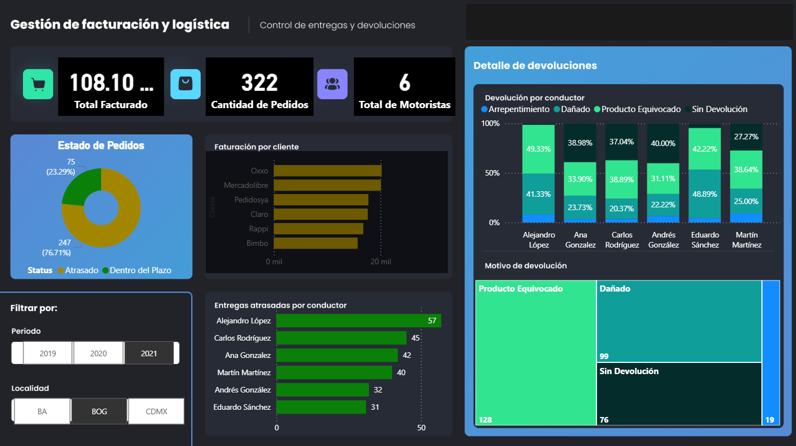
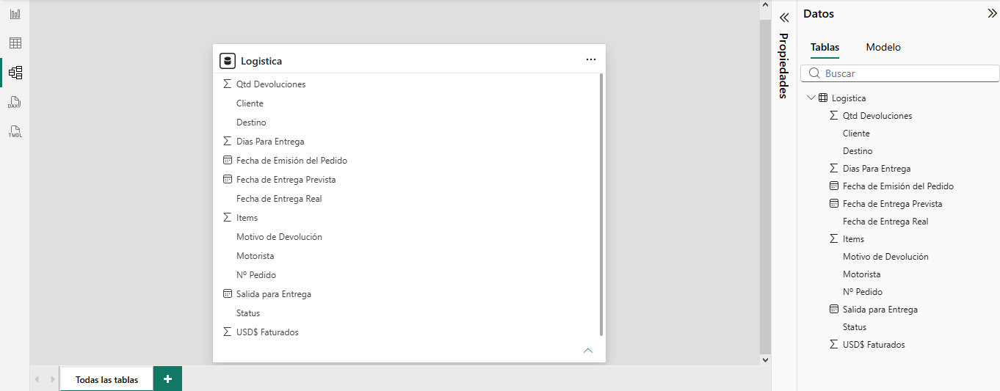

# 🚚 Logistics & Billing Analytics Dashboard

Power BI dashboard designed to analyze logistics operations, billing performance, delivery delays, returns, customers, and driver efficiency.



## 📌 Project Overview

This project analyzes logistics and billing data to provide a clear view of delivery performance and product returns.

The dashboard helps identify operational issues such as delayed deliveries, return causes, driver performance, and revenue distribution by customer.

The goal is to transform operational data into actionable business insights that can support better logistics decisions.

## 🎯 Business Questions

The dashboard was designed to answer questions such as:

- Which drivers have the highest number of delayed deliveries?
- What percentage of orders are delivered on time?
- What are the main causes of product returns?
- Which customers generate the highest revenue?
- Which drivers are associated with more product returns?
- How do delivery results change by period and location?

## 📊 Key Performance Indicators

The dashboard includes the following KPIs:

- 💰 Total Revenue
- 📦 Total Orders
- 🚚 Total Drivers
- ⏳ Delayed Deliveries
- ✅ On-Time Deliveries
- 🔄 Return Reasons
- 👤 Returns by Driver
- 🏢 Revenue by Customer

## 📈 Dashboard Analysis

### Order Status

The dashboard compares delayed orders against deliveries completed within the expected timeframe.

This allows the user to quickly identify the overall logistics performance.

### Driver Performance

Deliveries can be analyzed by driver to identify those with the highest number of delayed orders.

This information can support operational reviews and help detect recurring delivery problems.

### Return Analysis

Product returns are classified by reason, including:

- Wrong product
- Damaged product
- Customer regret
- Orders without returns

The dashboard also shows the distribution of return reasons for each driver.

### Customer Revenue

Billing information is analyzed by customer, making it possible to identify which clients generate the highest revenue.

## 🔎 Interactive Filters

The dashboard includes filters for:

- Period
- Location

These filters allow users to dynamically explore the information and compare logistics performance across different scenarios.

## 🧩 Data Model

The Power BI model connects logistics, customer, order, billing, driver, and return data to support interactive analysis across the dashboard.



## 🛠️ Tools & Technologies

- Microsoft Power BI
- Power Query
- DAX
- Data Modeling
- Data Visualization
- Business Intelligence
- Git
- GitHub

## 📂 Repository Structure

```text
PowerBILogistic/
├── FacturacionLogistica.pbix
├── README.md
├── assets/
│   └── dashboard-overview.png
└── docs/
    └── data-model.png
```

## 📁 Power BI File

The original Power BI project is available in this repository:

`FacturacionLogistica.pbix`

It can be downloaded and opened using Microsoft Power BI Desktop.

## 🚀 Planned Improvements

Future improvements for this repository include:

- Add the Power BI data model diagram.
- Add an animated dashboard demo.
- Convert the project to Power BI Project (`.pbip`) format.
- Add source control-friendly Power BI project files.
- Implement CI/CD validation using GitHub Actions.
- Explore automated deployment to Power BI Service / Microsoft Fabric.

## 👨‍💻 Author

**Cristiam Sanchez**

GitHub: [CristiamSanchez](https://github.com/CristiamSanchez)